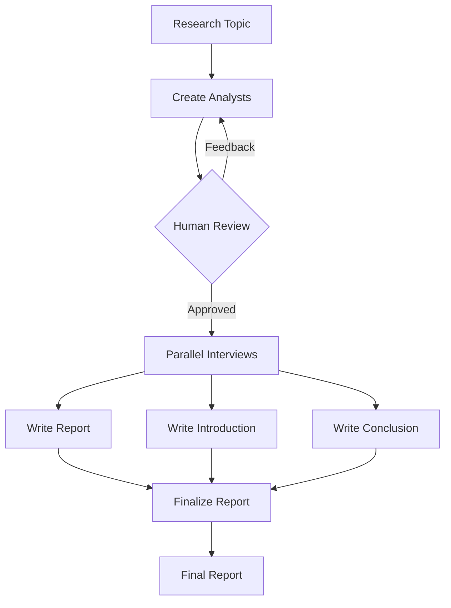
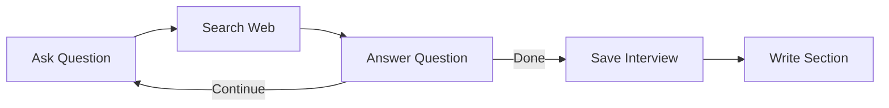

# Multi-Analyst Research Assistant

A multi-agent research assistant built with **LangGraph** that researches a given topic through multiple AI analyst personas and produces a structured, web-grounded report.

The system generates specialized analysts, allows human review, runs their research interviews in parallel, and combines the results into a final report with an introduction, body, conclusion, and sources.

A **Streamlit** interface is included for running the complete workflow from the browser.

---

## ✨ Features

* **Multi-Analyst Research** — Generates multiple analysts with different roles and research perspectives.
* **Human-in-the-Loop** — Review generated analysts and provide feedback before research starts.
* **Parallel Interviews** — Uses LangGraph's `Send` API to run an independent interview for each analyst.
* **Web-Grounded Research** — Uses Tavily to search the web and ground analyst answers in external sources.
* **Iterative Interviews** — Each analyst can ask multiple research questions until enough information is collected or `max_num_turns` is reached.
* **Structured Report** — Combines analyst research into an introduction, body, conclusion, and consolidated sources.
* **Swappable LLMs** — Supports Ollama, Groq, Google Gemini, and Hugging Face.

---

## 🏗️ Architecture

### Main Graph



### Interview Subgraph

Each analyst runs an independent interview workflow:



---

## 🧠 LangGraph Concepts

This project demonstrates practical use of:

* `StateGraph` for workflow orchestration
* **Graph State** for sharing workflow data
* **Conditional Edges** for routing and loops
* `interrupt()` for Human-in-the-Loop review
* `Send` for dynamic parallel execution
* **Subgraphs** for isolated analyst interviews
* **Reducers** for combining state updates

The main graph handles orchestration, while the interview subgraph handles the research process for each analyst.

---

## 🔄 Workflow

```text
Research Topic
      ↓
Create Analysts
      ↓
Human Review
   ↙       ↘
Feedback   Approved
   ↓          ↓
Regenerate   Parallel Interviews
                ↓
          Research Memos
                ↓
       Report Generation
                ↓
         Final Report
```

For each analyst:

```text
Ask Question → Tavily Search → Generate Answer
      ↑                              │
      └──────── More Research ───────┘
                                     ↓
                              Save Interview
                                     ↓
                              Write Section
```

---

## 🛠️ Tech Stack

| Area          | Technology                          |
| ------------- | ----------------------------------- |
| Orchestration | LangGraph                           |
| LLM Framework | LangChain                           |
| Local LLM     | Ollama                              |
| Default Model | `qwen3:1.7b`                        |
| Hosted LLMs   | Groq / Google Gemini / Hugging Face |
| Web Search    | Tavily                              |
| Data Models   | Pydantic                            |
| UI            | Streamlit                           |
| Language      | Python                              |

---

## ⚙️ Installation

### 1. Clone the repository

```bash
git clone <your-repository-url>
cd <your-project-folder>
```

### 2. Create a virtual environment

**Windows:**

```bash
python -m venv .venv
.venv\Scripts\activate
```

**Linux / macOS:**

```bash
python -m venv .venv
source .venv/bin/activate
```

### 3. Install dependencies

```bash
pip install -r requirements.txt
```

---

## 🔐 Configuration

Create a `.env` file:

```env
TAVILY_API_KEY=your_tavily_api_key

GROQ_API_KEY=your_groq_api_key
GOOGLE_API_KEY=your_google_api_key
HF_TOKEN=your_huggingface_token
```

Only configure the providers you use.

### Ollama

The default configuration uses:

```text
qwen3:1.7b
```

Pull it with:

```bash
ollama pull qwen3:1.7b
```

The LLM configuration can be changed in:

```text
src/utils/models.py
```

---

## ▶️ Usage

Start the Streamlit application:

```bash
streamlit run app.py
```

Then:

1. Enter a research topic.
2. Choose the number of analysts.
3. Review the generated analysts.
4. **Approve** them or provide feedback to regenerate them.
5. Wait while the analyst interviews run in parallel.
6. Review the generated research report.
7. Download the report as Markdown.

---

## 🎯 Project Goal

This project explores how **LangGraph can be used to build stateful, multi-agent workflows** rather than simple LLM chains.

It combines:

**Agents + Web Search + Human-in-the-Loop + Parallel Execution + Subgraphs + Structured Report Generation**

into one end-to-end research system.

---


